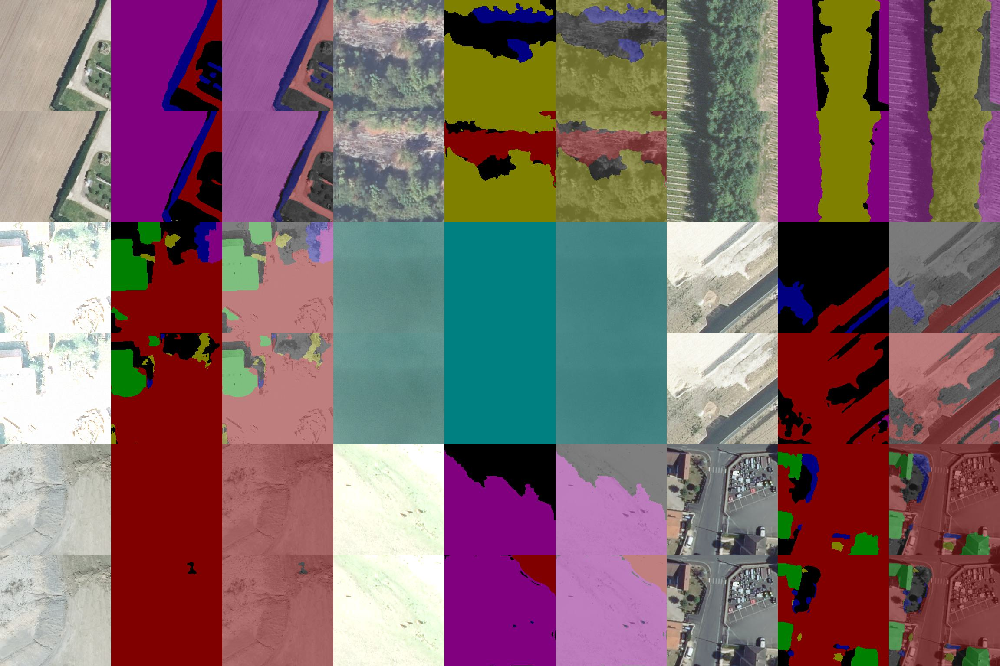

## Evaluating Segmentation Models on Aerial Datasets

### Description
This project envisions benchmarking segmentation models on aerial imagery dataset. 

 The project systematically evaluates and compares the performance of various segmentation algorithms, such as U-Net, DeepLab, HRNet, and SegNet on aerial datasets to assess their effectiveness in tasks like land cover classification.


#### Contact Person
The mainainer <[Kbostanov95@gmail.com](mailto:example@tum.de)>

## Installation

```bash
git clone https://gitlab.lrz.de/tulrfsd/sysid/students/2024_ma_islambostanov.git
cd $your-repository$

pip install -r requirements.txt
```

## Training

See [example](example).

## Accuracy

|  Model     |              Origin              | epoch | Accuracy |  Mean IU  |
|:----------:|:--------------------------------:|:-----:|:--------:|:---------:|
|   Unet++   | [link](https://github.com/shelhamer/fcn.berkeleyvision.org/tree/main/voc-fcn32s) |  100  |    -     | **-** |
| DeepLabV3+ | [link](https://github.com/shelhamer/fcn.berkeleyvision.org/tree/main/voc-fcn16s) |  100  |    -     | **-** |
|   SegNet   | [link](https://github.com/shelhamer/fcn.berkeleyvision.org/tree/main/voc-fcn8s)  |  100  |    -     | **-** |
|  HRNetV2   | [link](https://github.com/shelhamer/fcn.berkeleyvision.org/tree/main/voc-fcn8s-atonce) |  100  |    -     | **-** |

Visualization of validation result of Unet++




